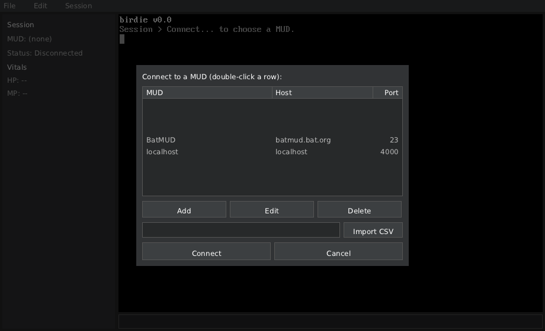
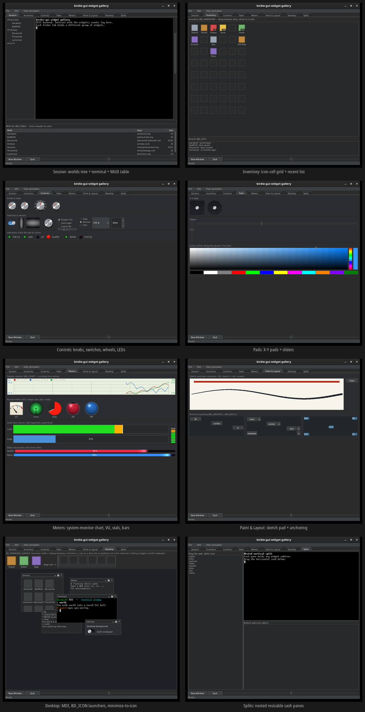

# birdie

A desktop MUD client written in C, with its own retained-mode GUI toolkit
(**birdie-gui**) drawn through a backend-neutral GPU interface. The default
backend is [ludica](https://github.com/OrangeTide/ludica) (rendering, input,
audio, networking); a second backend runs on raw X11/EGL/GLES.

The toolkit is reusable on its own. See
[`src/birdie-gui/README.md`](src/birdie-gui/README.md) for the birdie-gui
library, and "[Reusing birdie-gui](#reusing-birdie-gui)" below to vendor it into
another project.

## The MUD client

`birdie` is the desktop client: a menu bar, a session side panel, a terminal
output pane, and a command line, running on the ludica backend. The Session
menu opens a connect dialog backed by a sortable MUD-list table (add / edit /
import from CSV). Networking, triggers, and the scripting VM are wired in;
`main.c` is the shell that ties them to the UI.



## birdie-gui

**birdie-gui** is the retained-mode widget toolkit birdie is built on, reusable
as a standalone library. It draws through a small backend-neutral GPU interface,
so the same widget code runs on ludica, SDL3, or raw X11/EGL/GLES. The gallery
below (`make widget-test`) exercises the full widget set on the GLES backend:
menu + folder tabs, a libvt terminal, a data table, an inventory grid, rotary
knobs and dials, switches and wheels, X-Y pads, sliders, and a pressure/tilt
drawing canvas.



## Build

```sh
make                # debug build
make RELEASE=1      # optimized (-O2, LTO)
make clean
```

The client links the X11 + EGL + OpenGL ES runtime through ludica, so a debug
build needs their development headers:

```sh
sudo apt-get install -y libx11-dev libegl-dev libgles-dev   # Debian / Ubuntu
```

The binary lands at `_out/<triplet>/bin/birdie`, e.g.
`_out/x86_64-linux-gnu/bin/birdie`. Fonts and the terminal atlas are loaded
from `src/birdie-gui/assets/` relative to the working directory, so run it from
the repository root:

```sh
_out/x86_64-linux-gnu/bin/birdie
```

### Other make targets

| Target             | What it does                                                         |
| ------------------ | ------------------------------------------------------------------- |
| `make test`        | Headless GUI toolkit test (recording stub backend, no window/X11).  |
| `make widget-test` | Standalone widget gallery on the raw X11/EGL/GLES backend.          |
| `make dist`        | Bundle the birdie-gui toolkit into a versioned source ZIP.          |

`examples/` is a separate build (it carries its own `GNUmakefile`) so the main
build never depends on example-only libraries; `examples/sdl3/` hosts the
toolkit on an SDL3 window, and `examples/embed/` is a self-contained binary that
bakes its fonts and textures in with `.incbin` and the `bd_asset` registry.
Build them with `cd examples && make`.

The build system is [modular-make](https://github.com/OrangeTide/modular-make):
each directory has a `module.mk`, and the top-level one selects which are built.

## Releases

Tagging `vX.Y.Z` triggers the release workflow
([`.github/workflows/release.yml`](.github/workflows/release.yml)), which builds
and attaches to the GitHub Release:

- `birdie-gui-<version>.zip` — the birdie-gui toolkit source bundle.
- `birdie-<version>-linux-<arch>.tar.gz` — the MUD client, built for
  **x86_64**, **aarch64**, and **arm32** (Linux).
- `SHA256SUMS` — checksums for all of the above.

Each client tarball contains the `birdie` binary, its runtime assets, and a
`birdie.sh` launcher that starts it from the unpacked directory.

## Reusing birdie-gui

birdie-gui is distributed as the tagged source ZIP above. To vendor it into
your own project, run the bundled updater (it defaults to this repo's GitHub
release assets):

```sh
curl -fsSL https://raw.githubusercontent.com/OrangeTide/birdie/main/scripts/get-birdie-gui.sh \
    | sh -s -- 0.5.0 third_party/birdie-gui
```

Commit the script into your repo and re-run it with a newer version to update
in place. See [`scripts/get-birdie-gui.sh --help`](scripts/get-birdie-gui.sh)
and the library README for the build recipe.

## Source layout

- `src/birdie-gui/` — the birdie-gui toolkit (widget core, renderer, backend
  interface, the ludica and SDL3 backends, extension widgets, assets), built as
  the `birdie_gui` library.
- `src/birdie/` — the MUD-client app (`main.c`, networking, telnet, triggers,
  profiles, scripting VM); links the toolkit.
- `src/guitest/` — standalone widget gallery and the raw X11/EGL/GLES backend.
- `src/thirdparty/` — vendored dependencies (ludica, lua, lpeg, mbedtls, miniz,
  stb).
- `src/libvt/` — terminal escape-sequence processing for the terminal widget.
- `examples/` — separate project hosting the toolkit on other windowing libs.
- `doc/` — design documents; `concept.md` — original requirements.
- `scripts/` — vendoring/update helpers (`get-birdie-gui.sh`, `update-*.sh`).

Dependencies are vendored rather than linked from sibling repos, and are never
symlinked; each has an update script under `scripts/`. Provenance is recorded
in the `UPSTREAM` file beside each vendored tree.

## Target platforms

Linux (x86-64, aarch64, arm32) today. Windows (x86-64) is planned, with an NSIS
installer; macOS is a stretch goal.

## License

birdie's own source is dedicated to the public domain under
[CC0 1.0](LICENSE.txt). Vendored third-party components keep their own
licenses; see [LICENSE.txt](LICENSE.txt) for the list and pointers.
